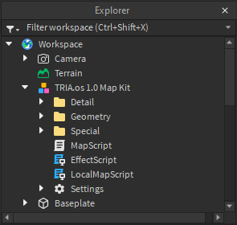
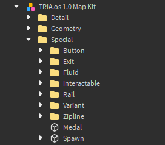

Here’s the map kit model as it’s shown inside the Explorer window. When TRIA.OS loads your map (which for now is just a map kit), it is loading this model into the game.

At the base level, the map kit structure is fairly simple, with most of the folders being self-explanatory except for the `Special` folder. The kit also contains a few different scripts by default which will run inside TRIA.os once the map is loaded, the most important one being `MapScript`.

***

## Detail
The Detail folder is for, well, map detail. Basically any non-essential things like small props and stuff that have nothing to do with gameplay can go under here at the map maker's discretion. Everything inside the Detail folder will not be loaded for players in Medium detail mode or lower. Low detail mode (LDM) additionally disables materials. A player's detail mode setting can be read as shown:

```lua
local SettingsFeature = MapLib:GetFeature("Settings")

local detailMode = SettingsFeature:GetSetting("Level of Detail")
```

## Geometry
The bulk of the geometry in your map should go here. If It's too important to go in the Detail folder, but not special enough to go in the Special folder, this is where you should probably put it.

## Special


All the interactive parts of your map get consolidated under this folder, which allows for faster map loading times (hence the official term `Optimized Structure`). The `Special` folder is meant to contain all the fun mechanics you see in the Kit, including but not limited to: 
- Spawn
- Buttons
- Exits
- Fluids
- Interactables (e.g. walljumps, air tanks, boosts)

***

## Scripts
Map scripts are direct descendants of the map model. The only one required for your map to load is `MapScript`, but there are some other ones that come with the map kit. Let's go over them at a basic level. Note that you aren't restricted to using just the default scripts- you can create as many as you like, so go wild (within reason)!

### MapScript
Our main map script which runs on the game Server. Most code, such as button functions and liquids moving, should be put in `MapScript`.

### LocalMapScript
Instead of running on Roblox servers, this client-sided script runs locally on players’ machines when they join a round. This is useful for things like effects, especially since they may run smoother on the client than on the server (think the spinning laser from Dystopia). However, anything that runs in `LocalMapScript' doesn’t replicate to spectators.

### EffectScript
This is an alternative to 'LocalMapScript' that allows client-sided code to be replicated to spectators, using RemoteEvents to communicate with the server-sided 'MapScript'. Something like the spinning laser in Dystopia can use 'EffectScript', since it’ll not only run smoothly for all players, but also appear properly for spectators.

***

## Settings


We can see that the Settings folder, which contains many different sub-folders, is also directly under the map model. We’ll go over the different settings later, but just know for now that this is where you’ll do stuff like give your map a name, a thumbnail, background music, etc. As mentioned earlier, many player settings can be read by map scripts using `MapLib:GetFeature("Settings")`.