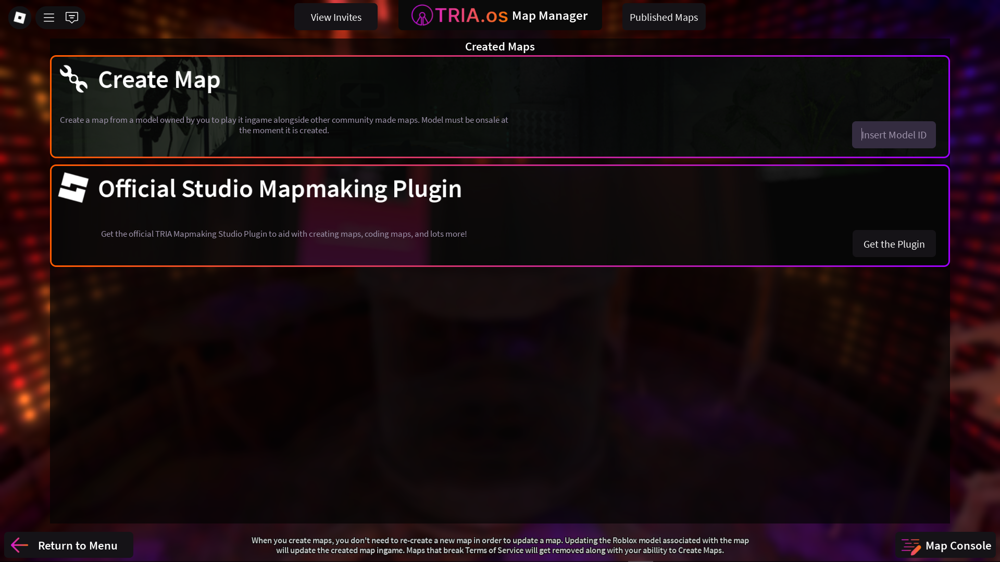

# "Creating" the Map (Whitelisting)
Formerly known as map whitelisting, the map "creation" process adds your map to an internal TRIA database, which helps TRIA staff moderate maps violating Roblox Terms of Service, among other things.

To start, save your map model (in this case, probably just the map kit) and set it to **on sale**, which is necessary for TRIA to obtain your map.

From the Map Manager, go to `Create Map` and enter the asset ID of the model you just set on sale. Press enter, and a new map slot should be created, containing the name of the map along with an auto-generated **short ID**. As the map owner, you're able to use the asset ID to load the map in game. However, anyone else will need to use the short ID.

Once the map is created, you may take the model off sale. To update the map, simply update the map model from Roblox Studio.