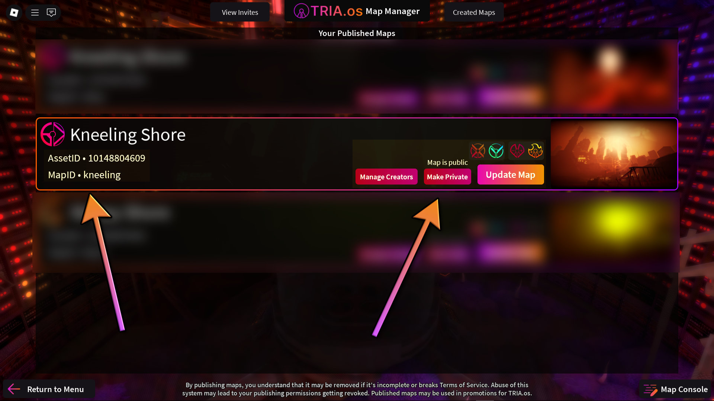

# Publishing
Once your map is complete, it's time to publish it, which is necessary to begin the verification process and for the map to appear in the Map List. To do this, click `Publish Map`, and as long as the map meets all the publishing requirements, it'll show up in `Published Maps`. The requirements include, but aren't limited to:
- Name must be 30 characters or less
- Must have a valid difficulty
- You must own the map model
- Account must be verified and at least 30 days old
- Map must be a model
- Unique name
- Unique map image
- Must used optimized structure (essentially the Special folder)
- Must be under 50k instances- for reference, Nos Astra has 49k, so it is highly unlikely you'll run into this one

Go back to `Published Maps`. When you first publish a map, it starts off as private, meaning it isn't visible on the map list. You can toggle it to public and vice versa. 

The `Manage Creators` menu allows you to add any additional creators to the map, which lets them appear as a creator when loading the map and lets them recieve any map donations.

Note that once you've published a map, the published version (accessible when loading from the map list) will not update even when you update the map model, hence the `Publish Update` button. If a map was previously verified (indicated by the blue icon), publishing an update will cause it to go back to the **Unverified** status (orange icon).