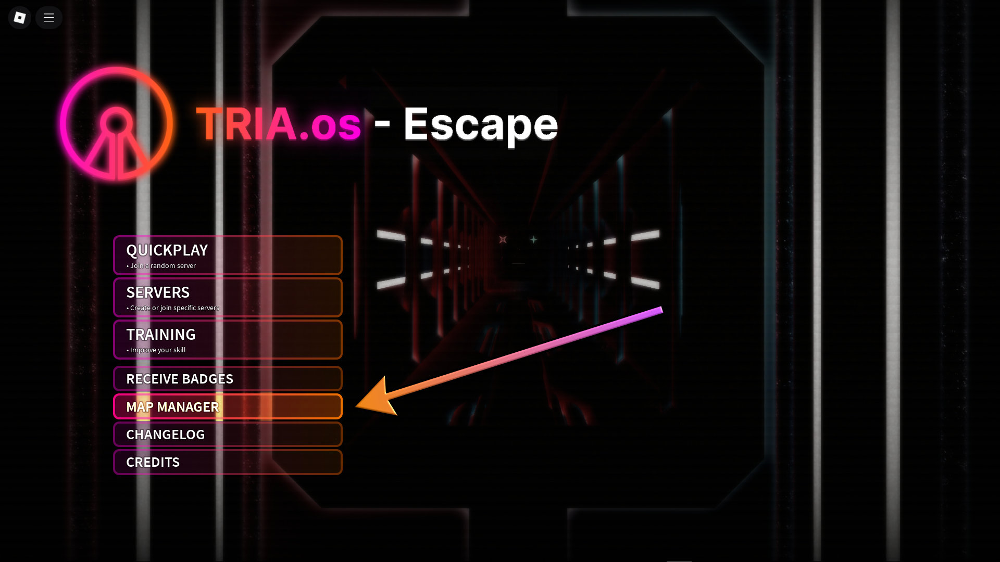

# Playing Your Map
In order to make your map playable, there are basically two steps:
1. "Create Map" (formerly whitelisting)
2. Map Publishing (private/public)

These two are both done from the Map Manager, which can be accessed within TRIA.os from the main menu.

Additionally, if you want players to gain awards from beating your map, you must go through the process of **Map Verification**.

