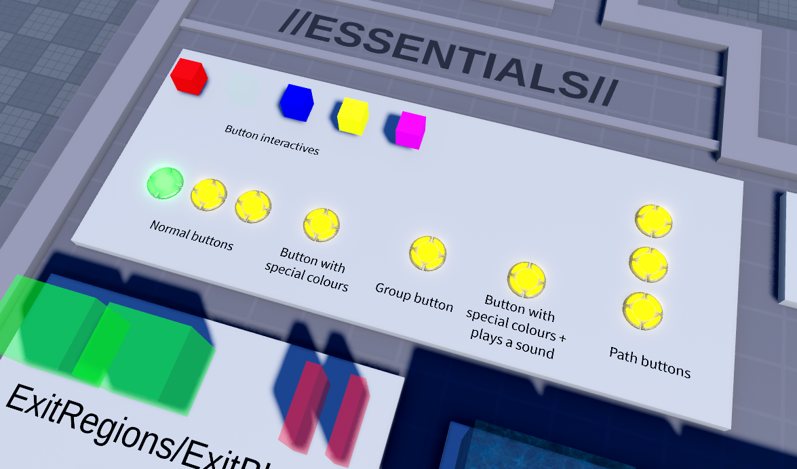
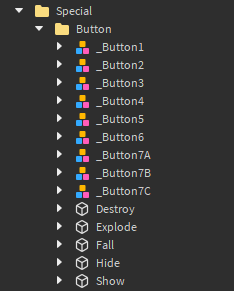
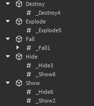
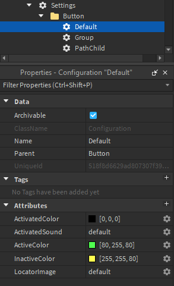

# Buttons

Buttons are used extensively in most TRIA.os maps. Progression through a level is usually locked behind pressing buttons, and players can only exit the map once all buttons are pressed. 

### Button Components
The map kit comes with buttons already, located inside `Special > Button`, but feel free to create your own, unique button design. All your button model needs is a Light component, which will change color depending on the state the button is in, and a Hitbox component. Buttons will typically have a Plate component as well to better fit with the map detail.

### Naming and Other Rules
All buttons must be named ‘_Button’ with a number at the end to denote the order in which they must be pressed. Buttons must be named sequentially, you can’t skip button numbers, and generally you can’t have multiple buttons with the same number… except when the map has button paths. 

### Button Types
#### Group Buttons
Group buttons require multiple people to press the button before being activated. You can make a group button by giving a normal button model a boolean attribute named ‘Group,’ and setting it to true. By default, half of all alive players in the map must press the button to activate it, but you can change this percentage by adding a number attribute named PlayerPercentage.

#### Path Buttons
Imagine having one button that can be activated from multiple different places. That’s essentially what path buttons allow you to do. You can have multiple buttons with the same number but each one has a different letter affixed to the end (A, B, C, etc.), which allows you to add different paths to your map with buttons.

### Button Events

Button event tags are used to add more functionality to buttons without scripting by adding `ObjectValue` instances to parts that you want to… well, do stuff. The names of these object values must contain an underscore (_), the event name, and a number corresponding to the button that activates the event. Here are all of the button events you may use. You have:

- _Fall#, which unanchors the part
- _Hide#, which sets transparency to 1 and disables collision
- _Show#, which sets transparency to 0 and enables collision
- _Destroy#, which removes the part from the workspace
- _Explode#, which makes part go boom
- You can also add a sound effect to the part using the same naming convention (_Sound#) but with a sound object parented to the part

If you want to add a delay to a button event, add a `NumberValue` named ‘_Delay’ under the ObjectValue and enter a delay value in seconds. Any parts with button events should be placed inside the Button folder, as well.

### Button Settings

Inside the `Settings` folder, you'll find a `Button` folder containing settings including:

- Color
    - Active: current button you need to press
    - Inactive: every button after the active button
    - Activated: buttons already pressed
- Activation sound
    - sound ID
- Locator image
    - image ID
    - four provided by default: default, classic, circle, square