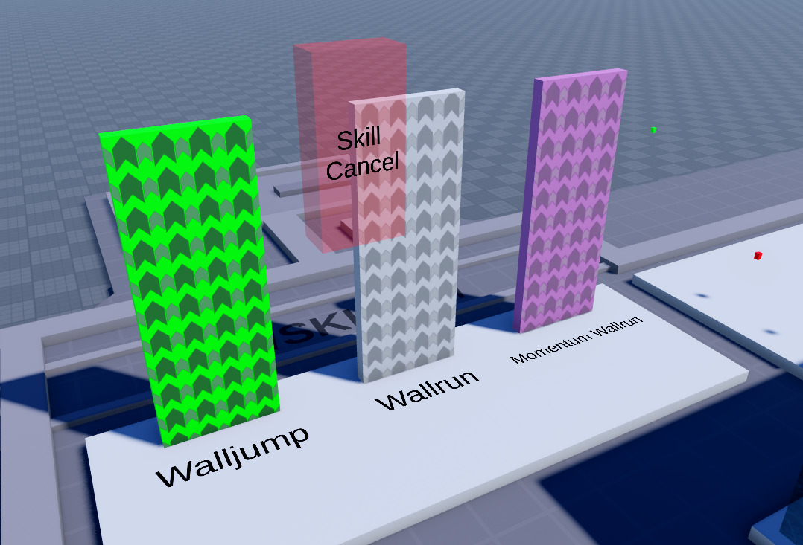

# Walljumps
Walljumps are parts you can latch onto and jump off of. To create a walljump from scratch, assign any part a `_action` string attribute and set it to `WallJump`, though it's a good idea to take one from the kit or insert using the TRIA plugin, since those come with the default walljump texture placed on the part's front face. 

You can add a `Timeout` number attribute to set the amount of seconds a player can stay on the walljump before falling off.

By default, players can latch onto any face of a WallJump part. You can change it to front face only by adding a `UseFrontOnly` boolean attribute. This is generally good practice, as it prevents (quite literal) edge cases from occuring.

# Wallruns
Wallruns (`_action` attribute set to `WallRun`) are essentially walljumps with an added movement mechanic, where attached players move along the part in the direction indicated by the beam. The wallruns included in the kit/plugin come with a `Speed` attribute using `studs/second`. 

You can resize the wallrun as you like, though you may need to manually adjust the width of the beam by going into the Beam's properties and changing properties `Width0` and `Width1`. 

By connecting wallrun pieces together, you can create curved or even upside-down wallruns!

## Momentum Wallruns
Momentum wallruns make it so you retain a certain amount of speed from the wallrun after you jump off by adding a `Momentum` number attribute, where `Wallrun Speed * Momentum` gives you how much speed a player will inherit. With a high momentum value, you can easily send players flying, no matter how fast the actual wallrun is, which can make for some fun behavior.

Normal wallruns and momentum wallruns are color coded in the map kit, and I’d recommend you do this too if you plan on using both of them in the same map, for example by changing the color as seen in the map kit.