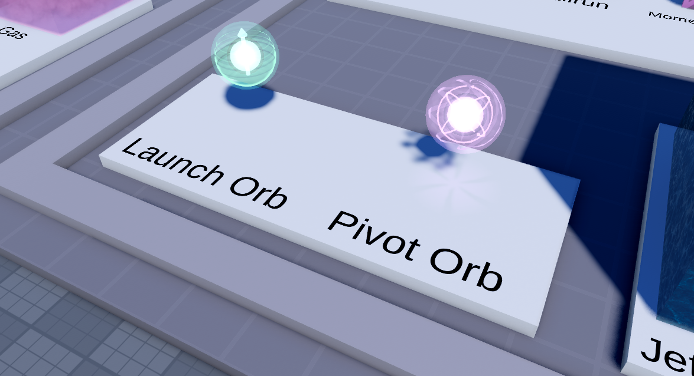

# Orbs

Mechanically similar, somewhat, to walljumps, players are able to jump inside of Orbs and launch themselves great distances. There are two types of Orbs: **launch Orbs**, which launch players in a set direction, and **pivot Orbs**, which let players choose their launch trajectory by turning their character.

Each Orb model contains a Hitbox mesh, and most notably, Orbs can be resized as small or as large as needed. They share the following attributes:

- Power `number`
    - Affects how powerful the launch is; somewhat analogous to jump power
- Timeout `number`
    - How long a player can stay inside an orb before falling out
- Type `string`
    - set to `Launch` or `Pivot`- you probably won't be changing this at all