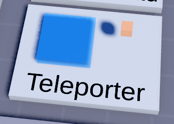

# Teleporters

When a player touches the blue `Teleporter` part, they’ll teleport to the orange `Destination` part found under `Teleporter > Destination`. 

The teleporter part has an attribute `SetCameraFront` that when enabled, the player will face where the front side of the `Destination` part is pointing, which is marked by the green SurfaceGui, after they teleport.