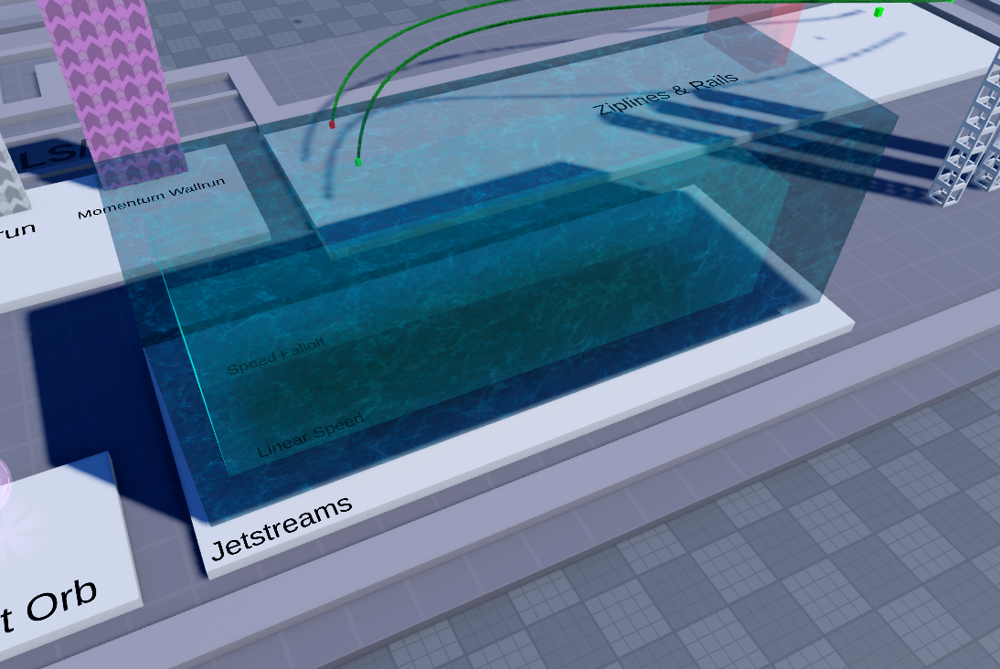

# Jetstreams

These enable underwater currents, running from the Back to the Front face of the `Jetstream` part. They contain the following attributes:

- _action `string`
    - set to `Jetstream`
- Falloff `bool`
    - toggles falloff in power of the jetstream as you move further away from the jetstream source
- Power `number`
    - self explanatory