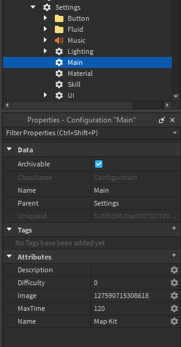

# Main Settings

The main settings contain, well, all the main things about your map: name, description, image ID for your map thumbnail, max time in seconds (after which all players who haven’t beaten the map are killed, you can set this up to 10 minutes), and map difficulty number. There are 7 main difficulties:

1. Easy
2. Normal
3. Hard
4. Insane
5. Extreme
6. Divine
7. Eternal
