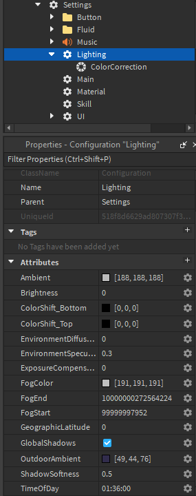

# Lighting

Lighting settings contain attributes which correspond to different Lighting properties, such as Ambient, Brightness, and the map’s Time of Day. 

You can also put objects such as Skyboxes, ColorCorrection, and Atmosphere under the Lighting folder, and these will be inserted into the game along with your map. You can modify lighting settings during a round using the TRIA.os Lighting feature.