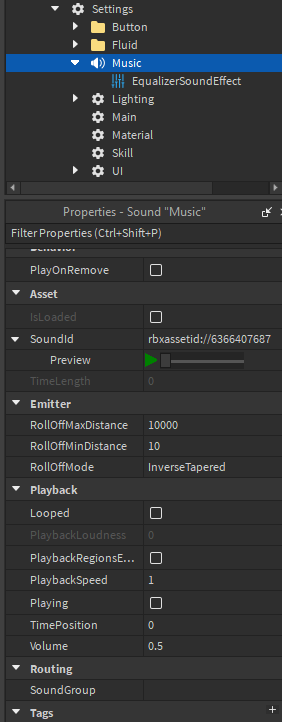

# Music

To set the music for your map, make sure there's a `Sound` instance under `Settings` containing the `SoundId` of the desired soundtrack.

If the soundtrack you want to use is not provided by Roblox's standard music library, you'll have to make sure your song is in [TRIA's music library](https://discord.com/channels/565208753914249256/951813104486973490). 

Steps for audio verification can be found in the TRIA discord server under [audio-verification](https://discord.com/channels/565208753914249256/1047094425911828490).
