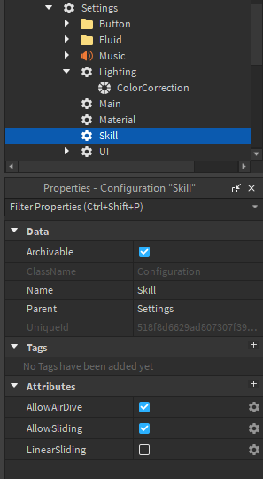

# Skills

The skills folder allows you to toggle various abilities, or ‘skills’. 

By default, TRIA comes with two skills, Sliding and Air Diving, which can be toggled individually both in this folder or via scripting. 

You can also toggle the type of sliding your map uses, either Linear sliding or non-linear sliding, which essentially acts as a speedboost ability with a cooldown, allowing you to do much longer jumps.