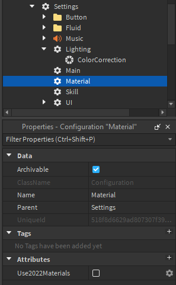

# Materials

The materials settings allows you to switch between Roblox’s new, 2022 materials or continue using the older ones, which TRIA.os uses by default. You can also insert MaterialVariants into the Materials folder if you want to use custom PBR materials.